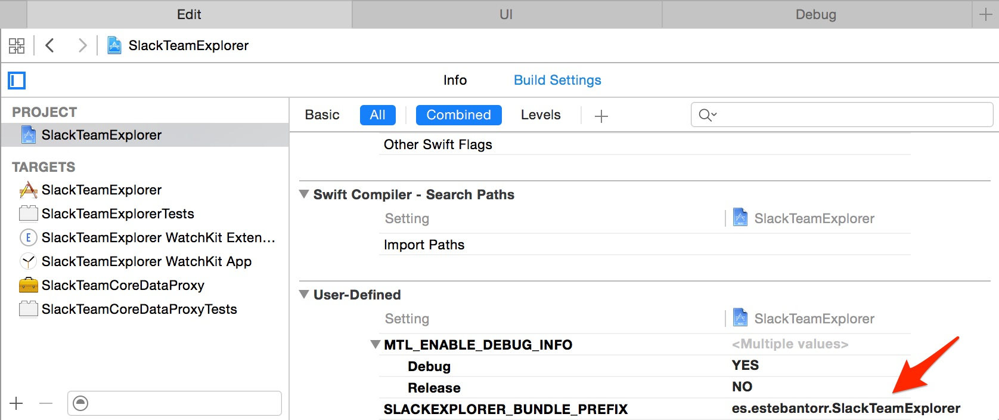
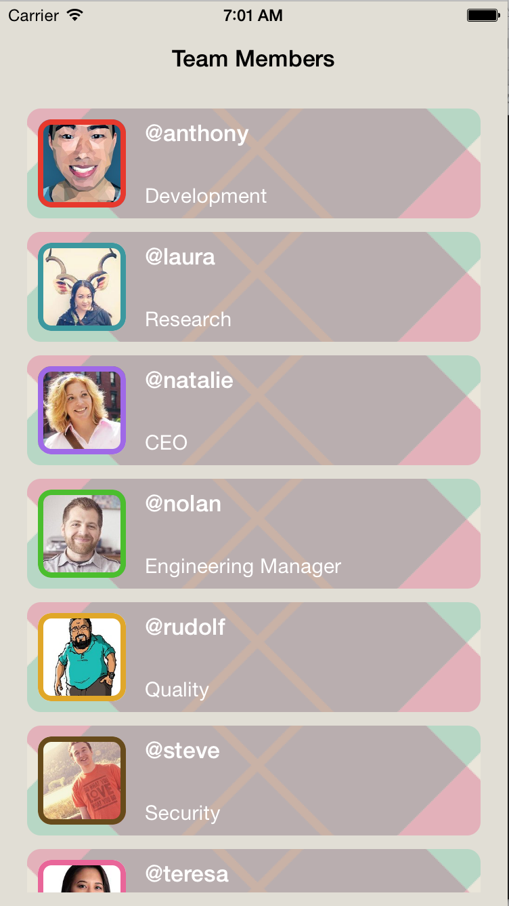
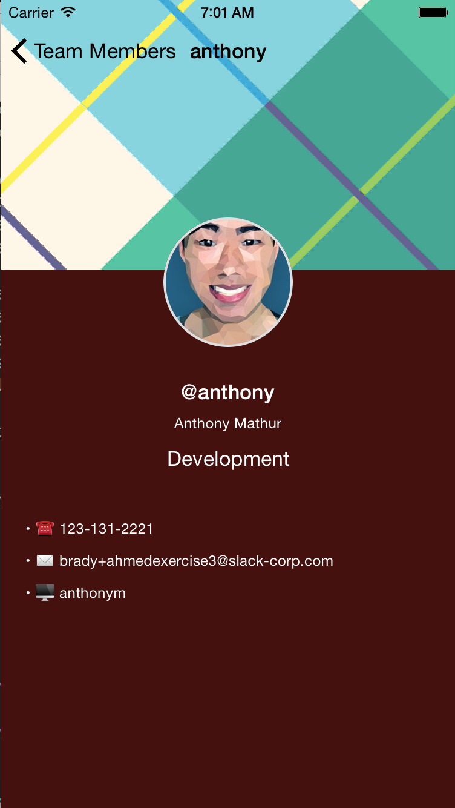
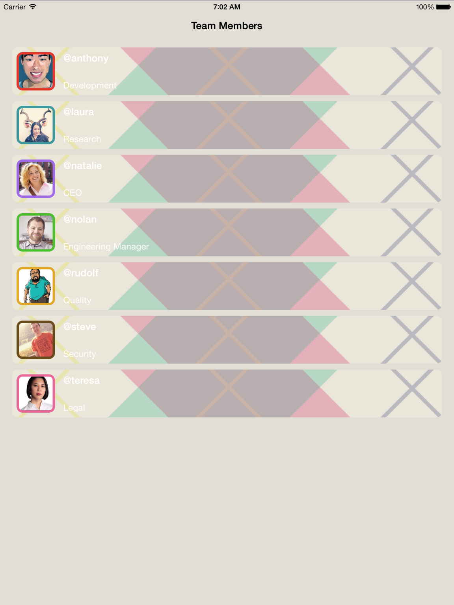
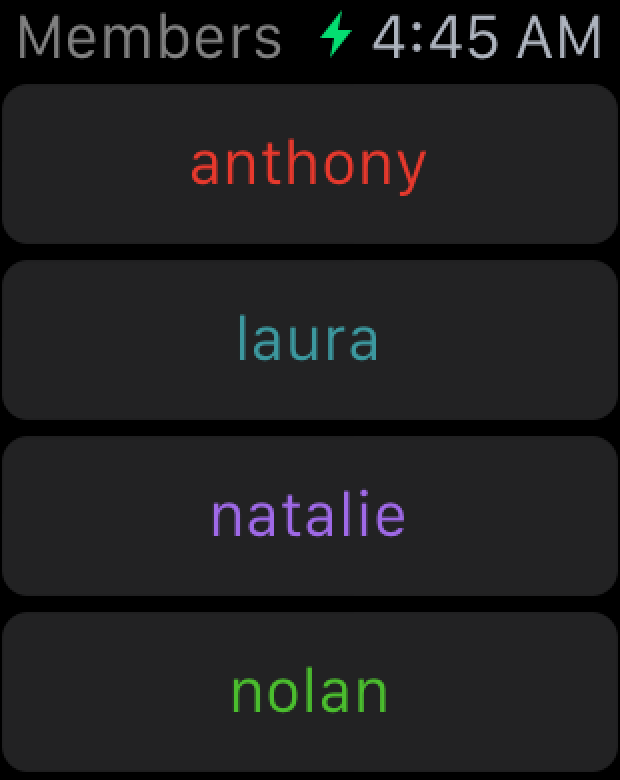

# SlackTeamExplorer
Explore Slack's teams (list all users and their basic profiles).

## Running the project

This project comes preconfigured except for the [«Entitlements»][caveats] setup required.

---
# Please follow the [«Finishing Touches»][caveats] section before trying to run the project.
---

### Notice
The project uses [`CocoaPods`][cocoapods] and [`Bundler`][bundler] but comes «fully» configured (save some [caveats][caveats]).

For the sake's of simplicity the «Pods» folder was pushed as well as the «vendor» from [`Bundler`][bundler] (but I strongly recommend against this).

There's a «burned» `API` token in the repo albeit its encrypted via `CocoaPods Keys` (one of the many reasons why you should refrain from pushing the «Pods» folder) which will compile and run the project as expected.

Check the following section if there's a need to know how to run the project from scratch (without the «Pods» and «vendor» folders).

### Installation
This project uses [`CocoaPods`][cocoapods] as its dependencies manager and should be installed; you can do so via running the following command:

```console
[sudo] gem install cocoapods
```

Or much easier by running:

```console
make bootstrap
```

The [`Makefile`][makefile] included in this project comes with a series of predefined tasks that will help the continuos development easier.

To run the `bootstrap` task you'll need to have [`bundler`][bundler] installed on your machine:

```console
[sudo] gem install bundler
```

This task will read the contents of [`Gemfile`][gemfile] and will fetch the source for each `gem` to the specific version and will use those versions; this way we can guarantee that everyone on the team will be using the same versions of each gem.

After all the `gems` are installed the task will execute an `update` command to be sure we are running the latest possible version (its possible to specify if we want to use a «range» of valid versions for a `gem`).

Once we have all the basic tools the task will proceed to run `pod install` and `pod update` which will do pretty much the same as the [`Gemfile`][gemfile] except for `Cocoa` code.

## Finishing touches
This project is a universal app that also supports an ᴡᴀᴛᴄʜ extension.

The way this project is structured is by using `App Groups` and sharing the `CoreData` instance across the extension and the main app.

In order to do this there's a couple of things that need to be done before compiling and running the project:

1. Set the project’s bundle identifier prefix.
2. Select your development team.
3. Create provisioning profiles.

### 1. Set the Project’s Bundle Identifier Prefix
Open app `Xcode`, select `SlackTeamExplorer` project -> Build Settings and change the `User Defined` value `SLACKEXPLORER_BUNDLE_PREFIX` to a globally unique reverse DNS string for your own
organization’s name.



### 2. Select Your Development Team
Select your paid iOS Developer Program account as the development team for each of the four targets below:

- SlackTeamExplorer
- SlackTeamExplorer WatchKit Extension
- SlackTeamExplorer WatchKit App
- SlackTeamCoreDataProxy

### 3. Create Provisioning Profiles
Create a provisioning profile for each of the three targets below:

- SlackTeamExplorer
- SlackTeamExplorer WatchKit Extension

Xcode helps you to create these provisioning profiles. First, select the `SlackTeamExplorer` project in the `Xcode` project navigator. Then, for each of the three targets listed above:

1. Select the target in the Targets list.
2. Select the General tab in the right-hand pane.
3. In the Identity section, under the Team popup menu, click Fix Issue.
4. Xcode will download a new provisioning profile for that target. (This
process may take up to 30 seconds per target.)


Supported Devices: 
===
Some screenshots of the app running on all supported devices:

## iPhone



## iPad



## ᴡᴀᴛᴄʜ


---
*Since the watch app was designed to not perform any web requests; if we run the watch app prior to running the `iPhone` app at least once we get the above warning.*

---




[cocoapods]:https://cocoapods.org
[bundler]:http://bundler.io/
[gemfile]:SlackTeamExplorer/Gemfile
[caveats]:#finishing-touches
[makefile]:SlackTeamExplorer/Makefile
